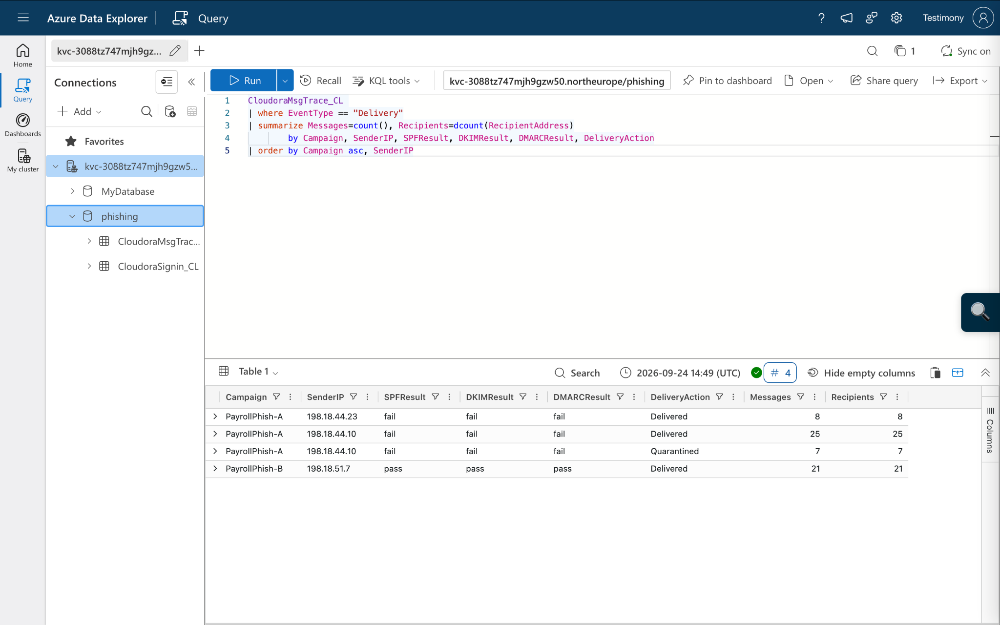
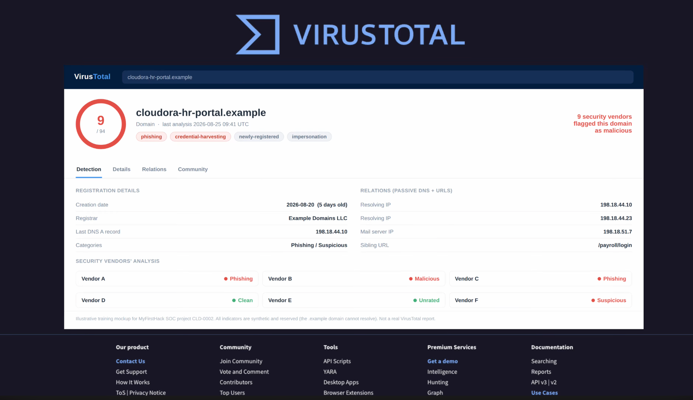
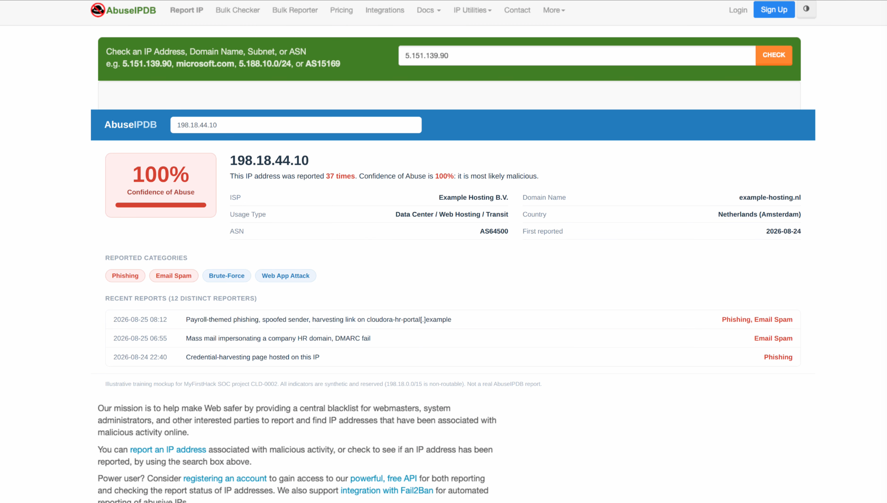
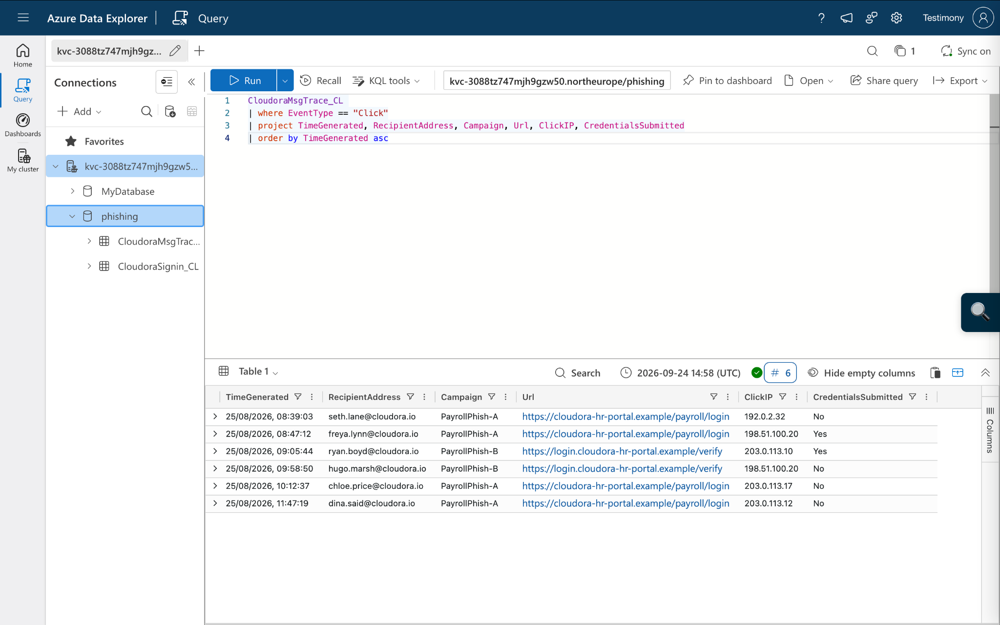
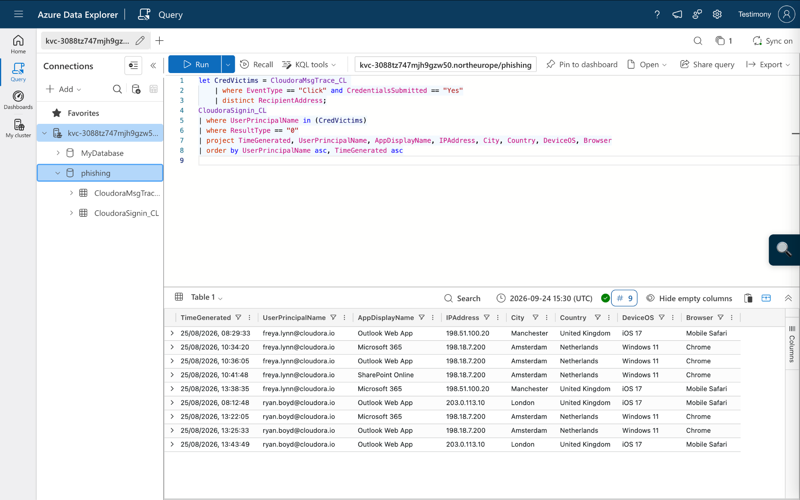
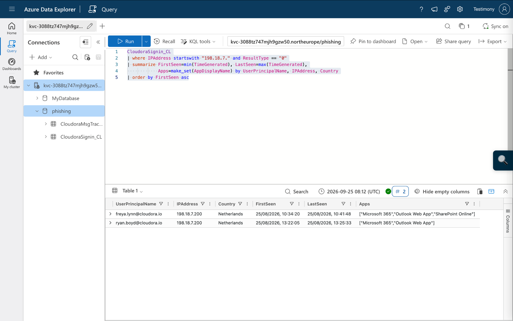
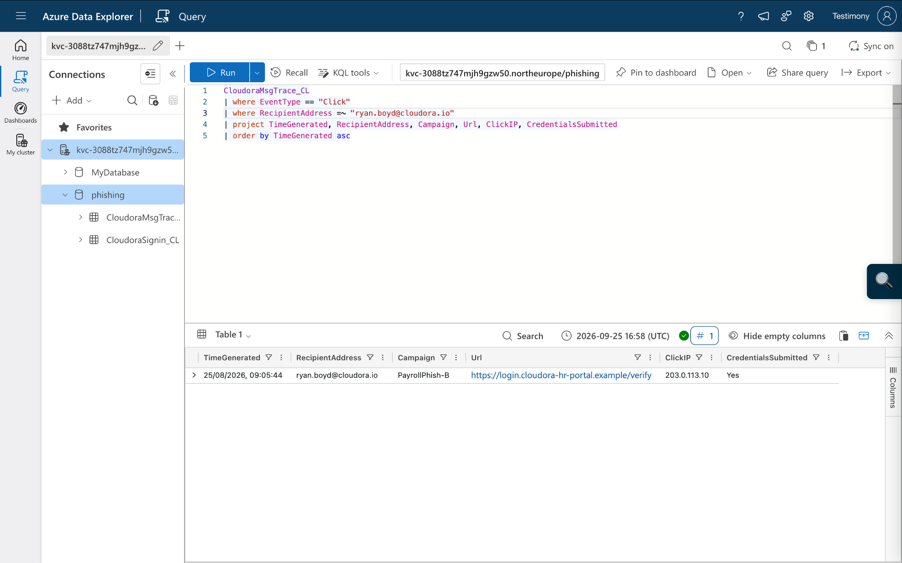
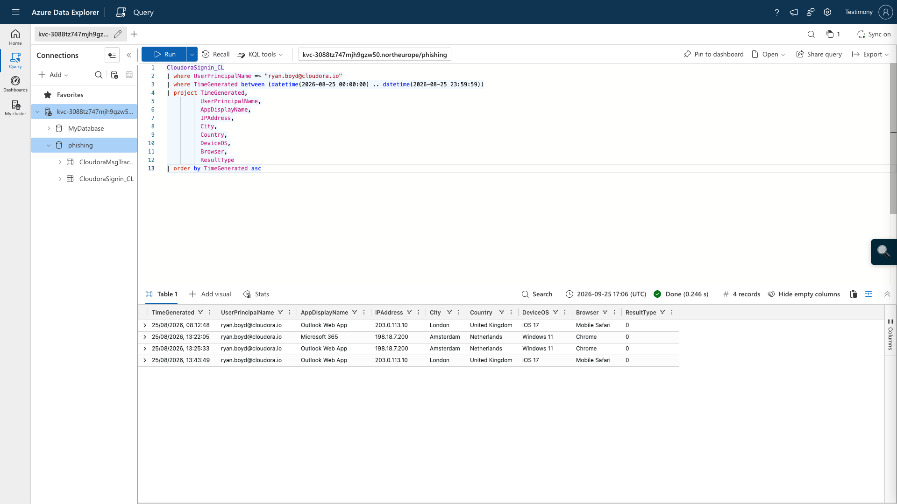

# Cloudora Payroll Phishing Campaign Investigation


## Executive summary

I investigated a payroll phishing campaign targeting a fictional B2B HR software company, Cloudora. The campaign used two delivery techniques:

- **Variant A:** direct spoofing of `cloudora.io`, with SPF, DKIM and DMARC failures.
- **Variant B:** an attacker-controlled lookalike domain, `cloudora-hr-portal.example`, that **passed SPF, DKIM and DMARC for the lookalike domain**.

I scoped the campaign using Azure Data Explorer and KQL, correlated email-click telemetry with identity sign-ins, and identified two accounts whose credentials were submitted and then used from the same anomalous Amsterdam source.

### Outcome at a glance

| Metric | Result |
|---|---:|
| Targeted mailboxes | 40 |
| Recipients with at least one delivered phish | 36 |
| Fully protected by quarantine | 4 |
| Users who clicked | 6 |
| Clicked but did not submit credentials | 4 |
| Credentials submitted | 2 |
| Confirmed compromised accounts | 2 |
| Shared suspicious sign-in IP | `198.18.7.200` |

The incident was handled through **Detection & Analysis → Containment → Eradication → Recovery → Post-Incident Activity**.

## Investigation workflow

### 1. Email triage and authentication

I compared two phishing emails with a legitimate Cloudora payroll email. Variant A failed SPF, DKIM and DMARC while impersonating the real Cloudora sender. Variant B passed authentication because it authenticated the attacker's lookalike domain rather than `cloudora.io`.



**Key lesson:** SPF/DKIM/DMARC passing does not prove that a sender is trustworthy; the analyst must determine **which domain authenticated and whether it is the expected domain**.

### 2. Infrastructure enrichment

The simulated threat-intelligence evidence associated the lookalike domain with phishing and credential harvesting and linked the campaign infrastructure to the observed sender and hosting IPs.





### 3. Campaign scoping

Message-trace telemetry was grouped by campaign, sender IP, authentication result and delivery action. This established the campaign's delivery footprint and showed that authentication failures did not prevent every Variant A message from reaching a mailbox.

The KQL is available in [`kql/01-campaign-scope.kql`](kql/01-campaign-scope.kql).

### 4. Click and credential analysis

Six users clicked a phishing URL. Four did not submit credentials; two did.



The two credential-exposed users were:

- `freya.lynn@cloudora.io`
- `ryan.boyd@cloudora.io`

### 5. Account compromise correlation

Both credential victims later had successful sign-ins from `198.18.7.200` in Amsterdam using Windows 11 / Chrome.



A tenant pivot on the suspicious source showed the same two affected accounts.



### 6. Ryan Boyd case study

Ryan submitted credentials to Variant B at **09:05:44 UTC**.



His incident-day timeline showed normal London/iOS activity, followed by successful Amsterdam/Windows/Chrome sign-ins at **13:22:05** and **13:25:33**, then a return to London/iOS activity at **13:43:49**.



This temporal sequence, combined with confirmed credential submission and the shared suspicious source used against Freya, supported the account-compromise finding.

## Indicators of compromise

| Type | Indicator | Role |
|---|---|---|
| Domain | `cloudora-hr-portal.example` | Lookalike phishing domain |
| Subdomain | `login.cloudora-hr-portal.example` | Credential-harvesting host |
| IPv4 | `198.18.44.10` | Variant A sending / campaign infrastructure |
| IPv4 | `198.18.44.23` | Variant A sending infrastructure |
| IPv4 | `198.18.51.7` | Variant B mail infrastructure |
| IPv4 | `198.18.7.200` | Suspicious successful sign-ins to both compromised accounts |

See [`docs/iocs.md`](docs/iocs.md) for the investigation context.

## MITRE ATT&CK mapping

| Tactic | Technique | Evidence |
|---|---|---|
| Initial Access | T1566.002 — Phishing: Spearphishing Link | Payroll emails directed users to phishing URLs |
| Credential Access | T1598.003 — Phishing for Information: Spearphishing Link | Credential-harvesting pages captured user credentials |
| Initial Access | T1078.004 — Valid Accounts: Cloud Accounts | Harvested credentials were used for successful Microsoft 365 access |

See [`docs/mitre-attack.md`](docs/mitre-attack.md).

## Incident response

**Detection & Analysis:** analysed headers and authentication, enriched infrastructure, scoped delivery, identified clickers and credential victims, and correlated sign-in telemetry.

**Containment:** revoked active sessions and refresh tokens for both compromised accounts and blocked the three sending IPs, suspicious sign-in IP, lookalike domain and subdomains at the mail gateway and web proxy.

**Eradication:** reset compromised credentials, required MFA re-registration, and purged phishing emails.

**Recovery:** returned the accounts to safe use after controls were restored and reviewed authentication telemetry for post-containment activity.

**Post-Incident:** documented findings and developed detection improvements and lessons learned.

## Detection engineering

The repository contains reusable KQL examples for:

- campaign delivery/authentication scoping;
- click and credential-submission analysis;
- identifying credential victims;
- user sign-in timelines;
- pivoting on suspicious infrastructure; and
- correlating a phishing click with a subsequent anomalous successful sign-in.

The correlation rule intentionally avoids hard-coding this campaign's attacker IP. In a production environment, I would baseline each user's normal countries/devices and use threat intelligence, Conditional Access and identity-risk signals to reduce false positives.

## Skills demonstrated

`KQL` · `Azure Data Explorer` · `Email Header Analysis` · `SPF` · `DKIM` · `DMARC` · `Phishing Investigation` · `Incident Response` · `Microsoft 365` · `Identity Investigation` · `IOC Analysis` · `MITRE ATT&CK` · `Detection Engineering`

## Repository structure

```text
.
├── README.md
├── incident-report/
│   └── Cloudora-Payroll-Phishing-Incident-Report.docx
├── kql/
│   ├── 01-campaign-scope.kql
│   ├── 02-click-analysis.kql
│   ├── 03-credential-victims.kql
│   ├── 04-signin-investigation.kql
│   ├── 05-attacker-ip-pivot.kql
│   └── 06-phishing-anomalous-signin-detection.kql
├── screenshots/
├── docs/
│   ├── investigation-notes.md
│   ├── iocs.md
│   └── mitre-attack.md
└── evidence/
    └── README.md
```