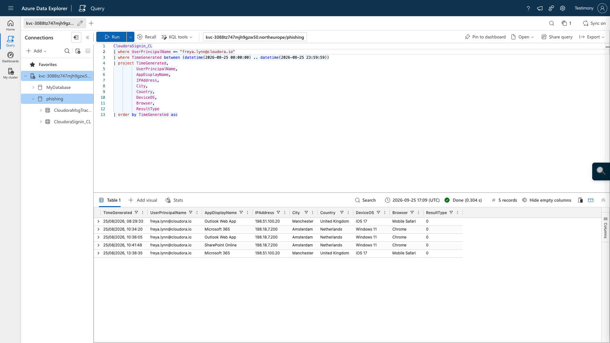

# Cloudora Payroll Phishing Campaign
## Incident Response Report

**Incident ID:** CLD-IR-0002  
**Related Ticket:** CLD-0002  
**Date:** 25 August 2026  
**Severity:** P1  
**Status:** Contained  
 
---

## 1. Executive Summary

On 25 August 2026, Cloudora was targeted by a payroll-themed credential phishing campaign impersonating the company's HR/payroll function.

The investigation identified two phishing techniques:

- **PayrollPhish-A** spoofed the legitimate `cloudora.io` domain and failed SPF, DKIM and DMARC.
- **PayrollPhish-B** used the attacker controlled lookalike domain `cloudora-hr-portal.example`. SPF, DKIM and DMARC passed because the attacker authenticated the lookalike domain rather than the legitimate `cloudora.io` domain.

Campaign scoping identified **40 targeted mailboxes**. At least one phishing message was delivered to **36 recipients**, while **4 recipients were fully protected by quarantine**. Six users clicked a phishing link. Four clicked without submitting credentials, while **Freya Lynn** and **Ryan Boyd** submitted credentials.

Both credential-exposed accounts were subsequently accessed successfully from `198.18.7.200`, geolocated to Amsterdam, Netherlands, using Windows 11 and Chrome. This activity differed from the users' observed legitimate UK/iOS activity and occurred after their credential submissions.

The incident was handled using a NIST-style lifecycle:

**Detection & Analysis → Containment → Eradication → Recovery → Post-Incident Activity**

Containment and remediation included revoking active sessions and refresh tokens, resetting compromised credentials, requiring MFA re-registration, blocking identified campaign infrastructure, purging phishing messages, and verifying that no further activity from the identified attacker sign-in IP occurred after containment.

---

## 2. Incident Overview

| Field | Details |
|---|---|
| Incident | Payroll-themed credential phishing |
| Initial vector | Phishing email containing credential-harvesting links |
| Target | Cloudora employees |
| Confirmed compromised accounts | 2 |
| Users who clicked | 6 |
| Users who submitted credentials | 2 |
| Suspicious sign-in source | `198.18.7.200` |
| Suspicious location | Amsterdam, Netherlands |
| Cloud services observed | Microsoft 365, Outlook Web App, SharePoint Online |
| Primary lookalike domain | `cloudora-hr-portal.example` |

---

## 3. Detection & Analysis

### 3.1 Email Authentication Analysis

The investigation began by comparing the suspicious payroll emails with a legitimate Cloudora payroll reference.

**Variant A — Direct domain spoofing**

The message claimed to originate from the legitimate Cloudora domain but failed email authentication:

- SPF: **Fail**
- DKIM: **Fail**
- DMARC: **Fail**

The campaign used sender infrastructure including:

- `198.18.44.10`
- `198.18.44.23`

Despite the authentication failures, some messages were delivered to users.

**Variant B — Authenticated lookalike domain**

The second phishing variant used:

`cloudora-hr-portal.example`

and the credential-harvesting host:

`login.cloudora-hr-portal.example`

This message passed SPF, DKIM and DMARC because those controls authenticated the attacker's own lookalike domain.

**Analyst conclusion:** Email authentication must be interpreted in the context of domain identity and alignment. A message can pass SPF, DKIM and DMARC while still being malicious if the authenticated domain is attacker controlled.


### 3.2 Infrastructure Enrichment

Simulated threat intelligence evidence associated the lookalike domain and related infrastructure with phishing and credential harvesting activity.


The threat intelligence results were treated as supporting evidence and correlated with the email and identity telemetry rather than being used as the sole basis for the incident findings.

---

## 4. Campaign Scoping

Message-trace telemetry was queried to establish the campaign's delivery footprint.

```kusto
CloudoraMsgTrace_CL
| where EventType == "Delivery"
| summarize Messages=count(), Recipients=dcount(RecipientAddress)
    by Campaign, SenderIP, SPFResult, DKIMResult, DMARCResult, DeliveryAction
| order by Campaign asc, SenderIP asc
```

The investigation established:

| Metric | Result |
|---|---:|
| Targeted mailboxes | 40 |
| Recipients with at least one delivered phishing email | 36 |
| Fully protected by quarantine | 4 |
| Users who clicked | 6 |
| Clicked without credential submission | 4 |
| Submitted credentials | 2 |
| Confirmed compromised accounts | 2 |

The four accounts whose phishing messages were fully quarantined were:

- `emma.hayes@cloudora.io`
- `maya.chen@cloudora.io`
- `nina.cole@cloudora.io`
- `ruth.dean@cloudora.io`

---

## 5. User Interaction Analysis

Click telemetry was analysed to determine which recipients interacted with the phishing campaign.

```kusto
CloudoraMsgTrace_CL
| where EventType == "Click"
| project TimeGenerated,
          RecipientAddress,
          Campaign,
          Url,
          ClickIP,
          CredentialsSubmitted
| order by TimeGenerated asc
```

Six users clicked a phishing link.

Four users clicked but did **not** submit credentials:

- `seth.lane@cloudora.io`
- `chloe.price@cloudora.io`
- `hugo.marsh@cloudora.io`
- `dina.said@cloudora.io`

Two users submitted credentials:

- `freya.lynn@cloudora.io`
- `ryan.boyd@cloudora.io`


---

## 6. Confirmed Account Compromise

The two credential victims were correlated with successful sign-in telemetry.

Both accounts subsequently authenticated from:

| Attribute | Observed value |
|---|---|
| IP address | `198.18.7.200` |
| Location | Amsterdam, Netherlands |
| Operating system | Windows 11 |
| Browser | Chrome |


A tenant wide pivot on the suspicious source identified the same two credential-exposed accounts.


### 6.1 Freya Lynn

Freya submitted credentials at **08:47:12 UTC**.

Successful Amsterdam activity from `198.18.7.200` began at **10:34:20 UTC** and included Microsoft 365, Outlook Web App and SharePoint Online.

Her observed legitimate activity used a Manchester IP with iOS 17 / Safari.



### 6.2 Ryan Boyd

Ryan submitted credentials to PayrollPhish-B at **09:05:44 UTC**.


His sign-in timeline showed:

| Time (UTC) | Location / IP | Device | Application | Assessment |
|---|---|---|---|---|
| 08:12:48 | London / `203.0.113.10` | iOS 17 | Outlook Web | Normal observed activity |
| 09:05:44 | London / `203.0.113.10` | — | Phishing link | **Credentials submitted** |
| 13:22:05 | Amsterdam / `198.18.7.200` | Windows 11 / Chrome | Microsoft 365 | **Suspicious successful sign-in** |
| 13:25:33 | Amsterdam / `198.18.7.200` | Windows 11 / Chrome | Outlook Web | **Suspicious successful sign-in** |
| 13:43:49 | London / `203.0.113.10` | iOS 17 | Outlook Web | Normal observed activity |


The credential submission, subsequent successful Amsterdam authentication, change in IP/location/device, and reuse of the same suspicious infrastructure against Freya supported the conclusion that Ryan's harvested credentials were used without authorisation.

---

## 7. Incident Timeline

| Time (UTC) | Event |
|---|---|
| 08:04–08:20 | PayrollPhish-A wave sent using spoofed Cloudora identity |
| 08:35–08:50 | Additional Variant A and Variant B campaign activity |
| 08:39:03 | Seth Lane clicked; no credential submission |
| 08:47:12 | **Freya Lynn submitted credentials** |
| 09:05:44 | **Ryan Boyd submitted credentials** |
| 09:11 | Suspicious payroll email reported to SOC |
| 09:58–11:47 | Additional click-only users identified |
| 10:34:20 | **First suspicious successful Freya sign-in from `198.18.7.200`** |
| 10:36–10:41 | Freya's suspicious session accessed Outlook Web and SharePoint Online |
| 13:22:05 | **First suspicious successful Ryan sign-in from `198.18.7.200`** |
| 13:25:33 | Ryan's suspicious session accessed Outlook Web |
| 14:00 | Containment actions initiated |

---

## 8. Indicators of Compromise

| Type | Indicator | Context |
|---|---|---|
| Domain | `cloudora-hr-portal.example` | Lookalike phishing domain |
| Subdomain | `login.cloudora-hr-portal.example` | Credential-harvesting host |
| URL path | `/payroll/login` | Variant A credential-harvesting path |
| URL path | `/verify` | Variant B credential-harvesting path |
| IPv4 | `198.18.44.10` | Variant A sending/campaign infrastructure |
| IPv4 | `198.18.44.23` | Variant A sending infrastructure |
| IPv4 | `198.18.51.7` | Variant B sending infrastructure |
| IPv4 | `198.18.7.200` | Suspicious successful sign-ins to both compromised accounts |
| Sender | `payroll@cloudora.io` | Spoofed sender used by Variant A |
| Sender | `payroll@cloudora-hr-portal.example` | Lookalike sender used by Variant B |

---

## 9. MITRE ATT&CK Mapping

| Tactic | Technique ID | Technique | Evidence |
|---|---|---|---|
| Initial Access | T1566.002 | Phishing: Spearphishing Link | Payroll phishing messages contained links to credential-harvesting pages |
| Credential Access | T1598.003 | Phishing for Information: Spearphishing Link | Users were directed to pages designed to collect credentials |
| Initial Access | T1078.004 | Valid Accounts: Cloud Accounts | Harvested credentials were subsequently used for successful cloud sign-ins |

The campaign also used a lookalike domain. T1583.001 — Acquire Infrastructure: Domains provides useful contextual mapping, although the actual registration activity was not directly observed in the supplied telemetry.

---

## 10. Scope and Impact

### Confirmed compromised — 2 accounts

**`freya.lynn@cloudora.io`**  
Submitted credentials and subsequently recorded successful authentication from the suspicious Amsterdam infrastructure. Microsoft 365, Outlook Web App and SharePoint Online were accessed.

**`ryan.boyd@cloudora.io`**  
Submitted credentials and subsequently recorded successful authentication from the same Amsterdam infrastructure. Microsoft 365 and Outlook Web App were accessed.

### Clicked but not confirmed compromised — 4 accounts

- `seth.lane@cloudora.io`
- `chloe.price@cloudora.io`
- `hugo.marsh@cloudora.io`
- `dina.said@cloudora.io`

These users clicked a phishing link but the supplied telemetry recorded `CredentialsSubmitted = No`. No anomalous sign-in was identified for them in the incident-day evidence reviewed.

### Delivered but no click — 30 accounts

Thirty additional users received at least one delivered phishing message but did not click.

### Fully protected by quarantine — 4 accounts

Four targeted users had every copy quarantined and therefore did not receive the phishing message in their inbox.

### Confirmed business impact

The supplied investigation evidence confirms account compromise and unauthorised access to Microsoft cloud services.

No fraudulent payment or confirmed data theft was identified in the supplied evidence.

---

# 11. Incident Response

## 11.1 Detection & Analysis

The SOC:

- analysed suspicious email headers and content;
- compared the phishing messages with a legitimate Cloudora reference email;
- reviewed SPF, DKIM and DMARC;
- investigated sender IPs, URLs and lookalike infrastructure;
- scoped campaign delivery and quarantine;
- identified users who clicked;
- identified credential submissions;
- correlated credential victims with successful sign-ins; and
- pivoted on suspicious infrastructure to identify the second compromised account.

## 11.2 Containment

Containment focused first on terminating the attacker's existing access.

### Actions

1. **Revoked active sessions for both compromised accounts.**
2. **Invalidated refresh tokens** to terminate previously authenticated cloud sessions.
3. Blocked the three observed phishing sending IPs:
   - `198.18.44.10`
   - `198.18.44.23`
   - `198.18.51.7`
4. Blocked the suspicious account-access IP:
   - `198.18.7.200`
5. Blocked:
   - `cloudora-hr-portal.example`
   - associated subdomains, including `login.cloudora-hr-portal.example`
6. Applied infrastructure blocks at the simulated **mail gateway and web proxy**.

Revoking sessions before resetting credentials was important because changing a password alone may not immediately terminate an already authenticated session.

## 11.3 Eradication

After attacker access was contained:

1. Passwords for both compromised accounts were reset.
2. Existing MFA registrations were reviewed/reset.
3. Both users were required to re-register approved MFA methods.
4. Identified phishing emails were purged from affected mailboxes.

These actions removed the compromised authentication material and remaining phishing content from the environment.

## 11.4 Recovery

The affected accounts were returned to normal use after:

- session revocation;
- credential reset;
- MFA re-registration; and
- verification of legitimate account access.

Authentication telemetry was reviewed after containment to identify any continued activity associated with the suspicious infrastructure.

Within the supplied training evidence, no further successful activity from `198.18.7.200` was identified after containment.

## 11.5 Post-Incident Activity

The investigation was documented and reviewed to identify improvements in:

- email filtering;
- lookalike-domain detection;
- identity monitoring;
- phishing reporting;
- MFA controls; and
- automated phishing-to-sign-in correlation.

---

## 12. Detection Engineering

One of the main lessons from the incident was that the compromises were visible in telemetry shortly after the phishing interactions but required manual correlation.

A reusable scheduled analytic can correlate a phishing click with a subsequent successful sign-in from a different IP and an unexpected country.

```kusto
let CorrelationWindow = 6h;
let NormalCountries = dynamic(["United Kingdom", "United States"]);

let Clicks =
    CloudoraMsgTrace_CL
    | where EventType == "Click"
    | project
        ClickTime = TimeGenerated,
        UserPrincipalName = RecipientAddress,
        Url,
        ClickIP,
        CredentialsSubmitted;

CloudoraSignin_CL
| where ResultType == "0"
| project
    LoginTime = TimeGenerated,
    UserPrincipalName,
    IPAddress,
    Country,
    City,
    DeviceOS,
    Browser,
    AppDisplayName
| join kind=inner Clicks on UserPrincipalName
| where LoginTime between (ClickTime .. (ClickTime + CorrelationWindow))
| where IPAddress != ClickIP
| where Country !in (NormalCountries)
| extend MinutesAfterClick =
    datetime_diff("minute", LoginTime, ClickTime)
| project
    UserPrincipalName,
    ClickTime,
    CredentialsSubmitted,
    Url,
    LoginTime,
    MinutesAfterClick,
    IPAddress,
    Country,
    City,
    DeviceOS,
    Browser,
    AppDisplayName
| order by LoginTime asc
```

### Production improvement

The static country list should not be treated as the final production design.

A stronger implementation would baseline each user's normal sign-in countries, IP ranges and devices over a historical period and detect deviations following a phishing interaction. This makes the detection behavioural rather than dependent on the specific Amsterdam infrastructure used in this incident.

---

## 13. Recommendations

1. **Strengthen DMARC enforcement** for `cloudora.io` after validating all legitimate senders, reducing successful direct-domain spoofing.

2. **Improve lookalike-domain detection.** Email authentication alone will not stop attacker-owned domains that correctly configure SPF, DKIM and DMARC.

3. **Deploy phishing-to-sign-in correlation.** Alert when a phishing interaction is followed by a successful authentication from a new or anomalous IP, country or device.

4. **Use historical user baselines.** Compare new authentication events against each user's normal location and device behaviour instead of relying only on static country lists.

5. **Maintain IOC blocking and threat hunting.** Confirmed malicious domains, subdomains and infrastructure should be blocked while analysts continue looking for infrastructure reuse.

6. **Maintain strong MFA controls.** Require MFA and monitor for unexpected authentication-method registration or changes following suspected credential theft.

7. **Continue phishing awareness training.** Reinforce that Cloudora will not request passwords, bank details or sensitive account information through unexpected email links.

---

## 14. Lessons Learned

The investigation demonstrated the importance of correlating multiple security data sources rather than treating individual alerts in isolation.

The attack chain was reconstructed as:

```text
Phishing email
      ↓
Email authentication analysis
      ↓
Campaign scoping
      ↓
Phishing link click
      ↓
Credential submission
      ↓
Successful anomalous sign-in
      ↓
Account compromise
      ↓
Containment and remediation
```

A particularly important lesson was that **SPF, DKIM and DMARC passing does not prove that an email is trustworthy**. Variant B passed authentication because the attacker controlled and authenticated the lookalike domain. The relevant question for the analyst is not simply *"Did authentication pass?"* but *"Which domain authenticated, and is that the expected legitimate domain?"*

Pivoting from the first compromised account to the suspicious sign-in IP also demonstrated the value of infrastructure-based threat hunting: the pivot identified the second compromised account.

The main detection gap was correlation speed. An automated rule linking phishing interaction to anomalous successful authentication could have identified both compromises earlier and reduced reliance on manual investigation.

---

## 15. Incident Closure

The incident was assessed as contained within the supplied training evidence.

The two compromised accounts were remediated, active sessions and refresh tokens were revoked, exposed credentials were reset, MFA was re-registered, identified malicious infrastructure was blocked, and phishing messages were purged.

Post-containment authentication review did not identify further successful activity from the identified suspicious sign-in IP.

Continued monitoring and implementation of the recommended detection improvements remain appropriate.

---

## Skills Demonstrated

`Phishing Investigation` · `KQL` · `Azure Data Explorer` · `Email Header Analysis` · `SPF` · `DKIM` · `DMARC` · `Microsoft 365` · `Identity Investigation` · `Incident Response` · `Threat Hunting` · `IOC Analysis` · `MITRE ATT&CK` · `Detection Engineering`

---

**Project type:** Simulated SOC / Incident Response investigation  
**Purpose:** Cybersecurity portfolio and practical SOC investigation demonstration
